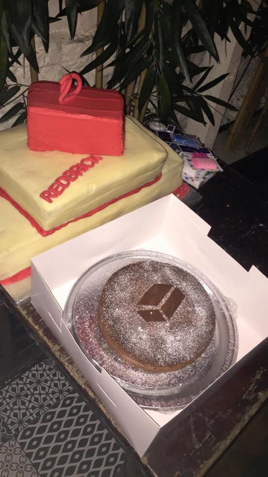

Hi all:

We’ve had a busy week with a talk, quiz and the AGM. Last week was the AGM or
the shuffling of Committee, when we say good bye to some old faces and hello to
some new ones. As those of you who attended the AGM know, I was appointed as
Redbrick’s new and shiny secretary, I look forward to a year writing badly
worded but informing announces for my adoring public. Now down to business…

 <!-- more -->

- Redbrick 20th Birthday - Saturday 09/04 - Opium Cafe - 19:00

# AGM Results

The results of the AGM election on Thursday are as follows:

- Noah Donnelly (cac) - Chair
- Cian Butler (butlerx) - Secretary
- Ross O'sullivan (sully) - Treasurer
- Cliodhna Harrison (thegirl) - Events
- Liam Rooney (ginger) - PRO
- Cormac Smartt (pints) - Helpdesk
- Lorcan Boyle (zergless) - Admin
- Richie Walsh (koffee) - Admin

# Redbrick 20th Birthday

- Date: Saturday 09/04
- Time: 19:00
- Location: Opium Cafe, Wexford Street, Dublin
- More info: http://birthday.redbrick.dcu.ie/

The cake has been ordered, showers have been had, cat sitters have been arranged
and the hoodies have been ironed…. Yes that’s right, Redbrick’s 20th birthday is
just around the corner! The event is taking place this very Saturday at Opium
Cafe in town so head on over to the birthday website to reserve your ticket if
you haven’t already done so. We look forward to seeing both students and
associates for a few drinks and a bit of gossip. Any questions? Just give us a
shout...

We are all looking forward to seeing you.

As always, keep your eyes peeled on the lovely calendar and social media pages:

- Twitter: @RedbrickDCU
- Facebook: https://www.facebook.com/dcuredbrick
- Snapchat: RedbrickDCU
- Calendar: http://tinyurl.com/redbrickCalendar

Hoping you have a good week from all of the Redbrick Committee. Bye for now.
