## 2017
[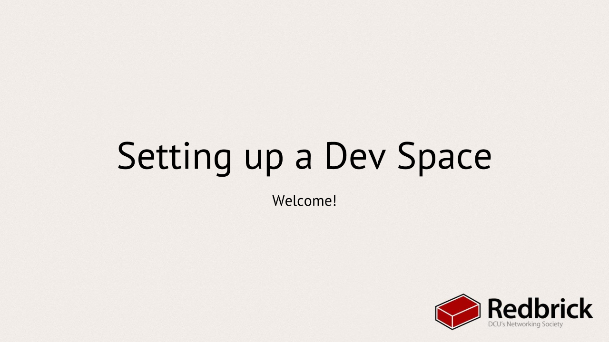](./SettingUpDevEnv)
[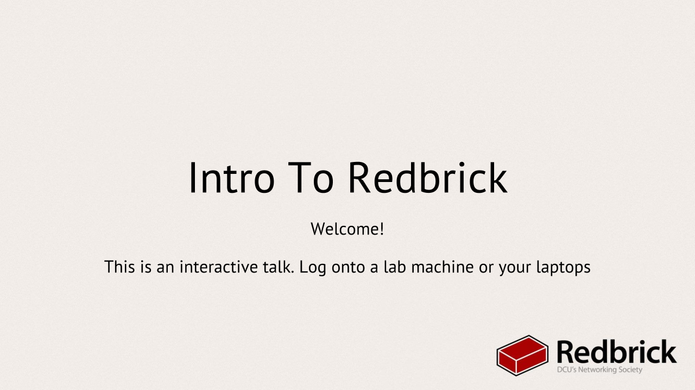](./IntroToRedbrick)
[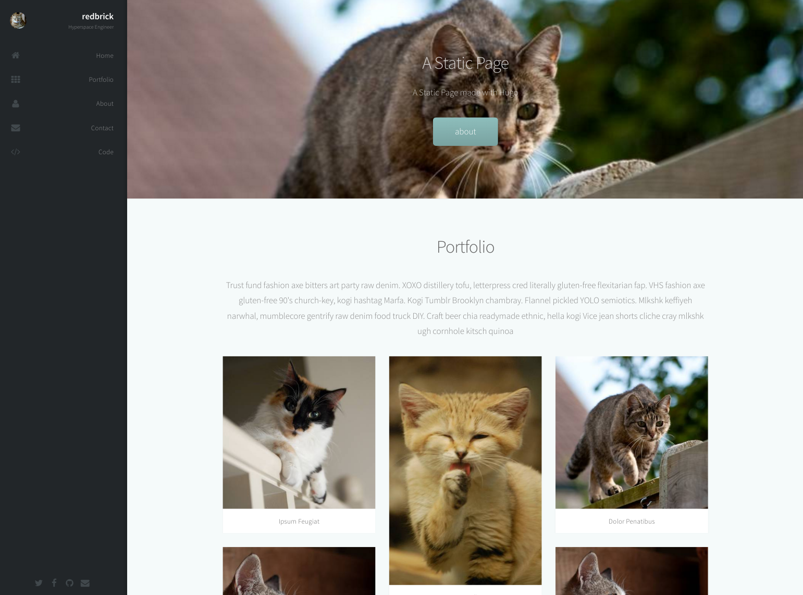](./static-web)

[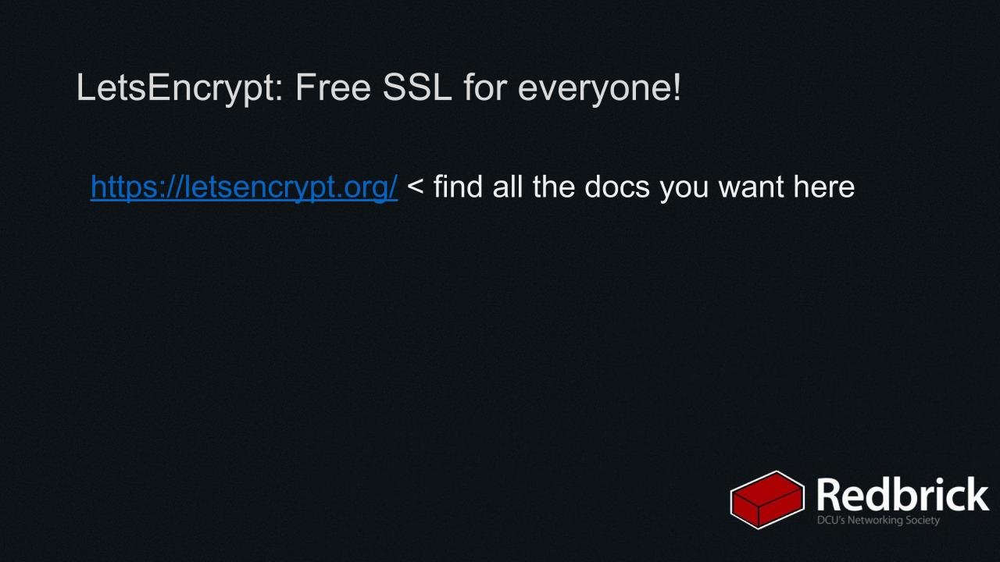](./HowToMakeAWebserver)
[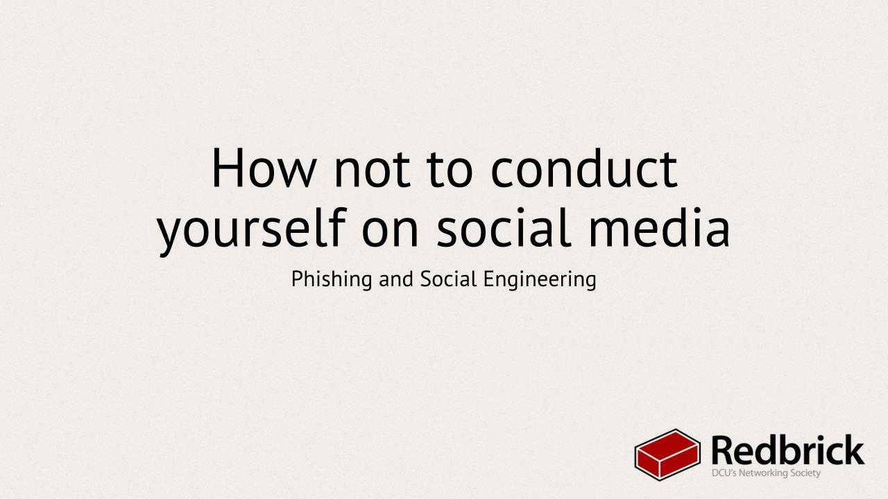](./PhishingAndScams)

## 2016
[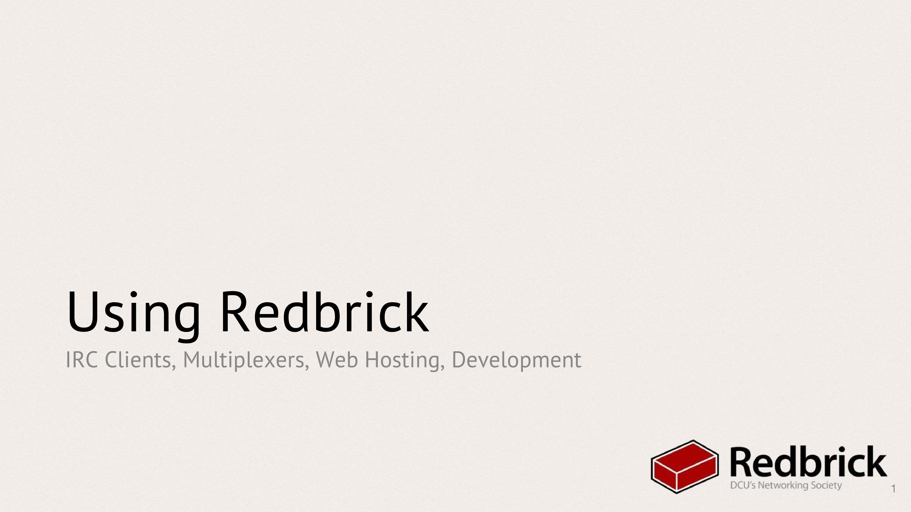](./usingrb2016)
[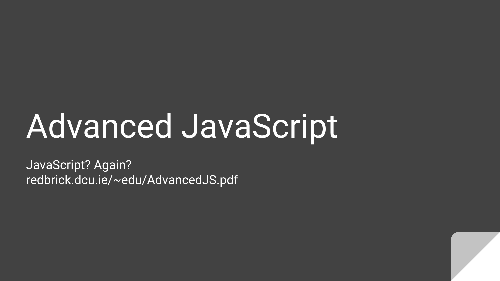](./AdvancedJavaScript)

[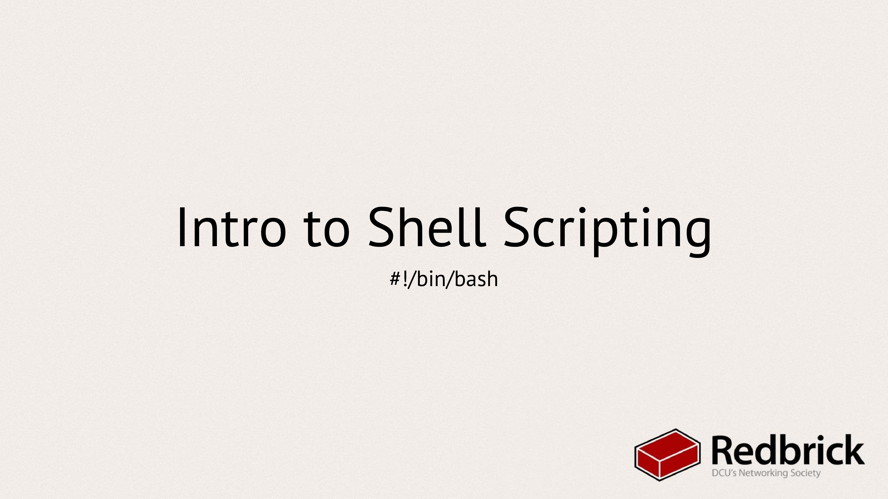](./IntroToBash)

[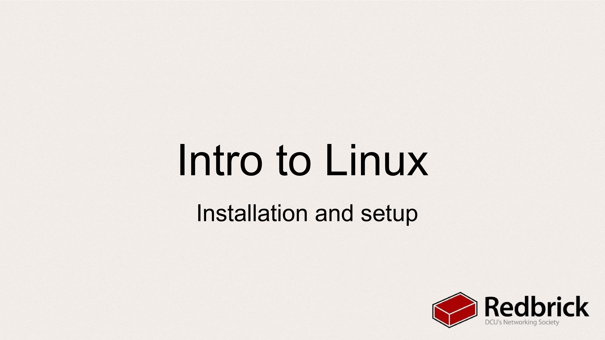](./IntroToLinux)

[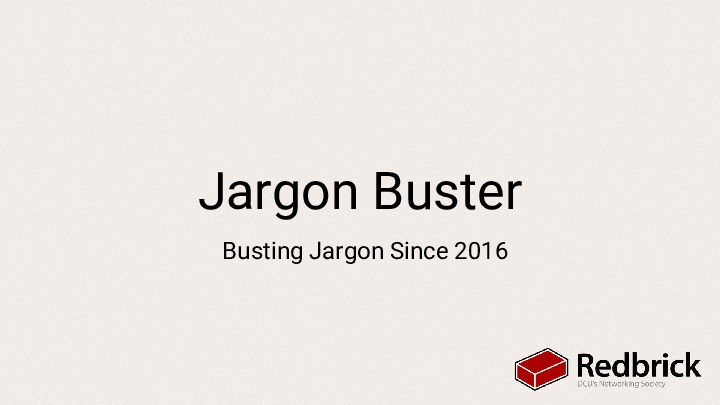](./Jargon_buster)
[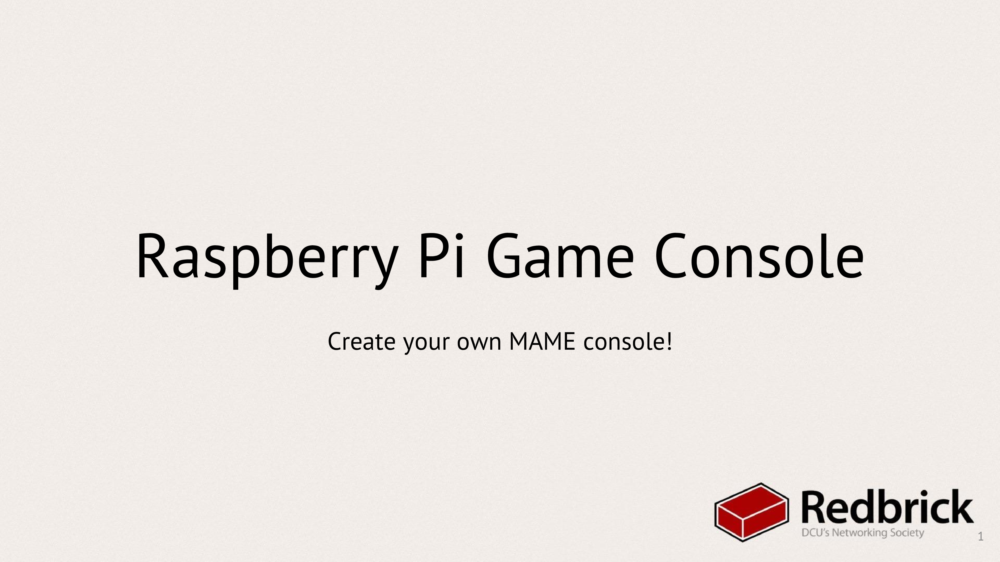](./RetroPie)

[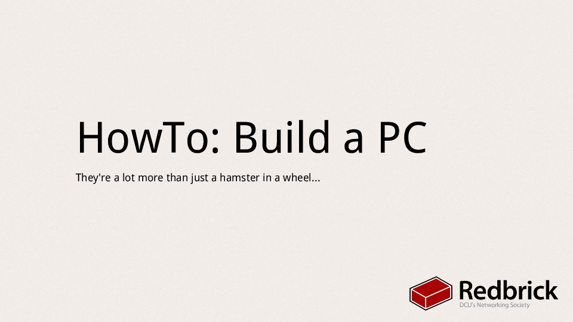](./buildpc)

## 2015
[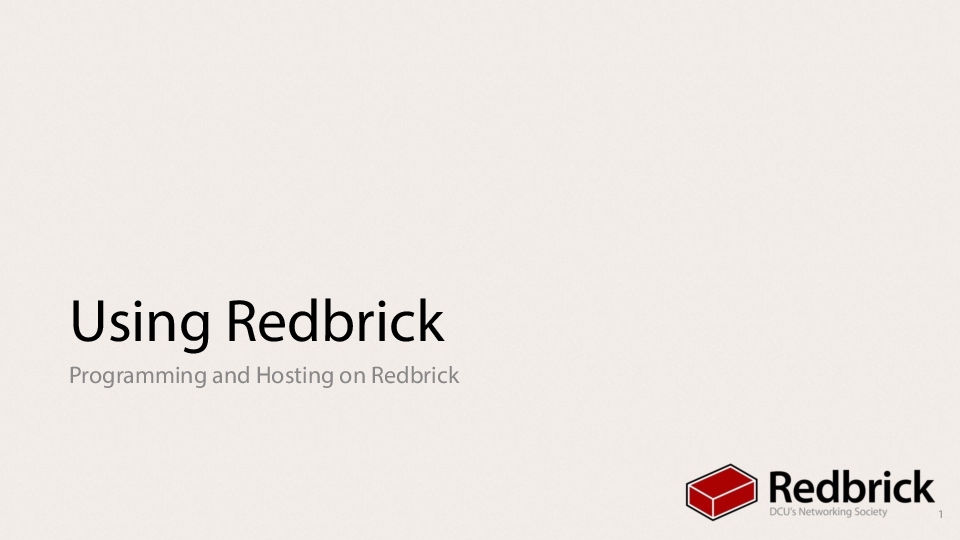](./usingrb2015)

[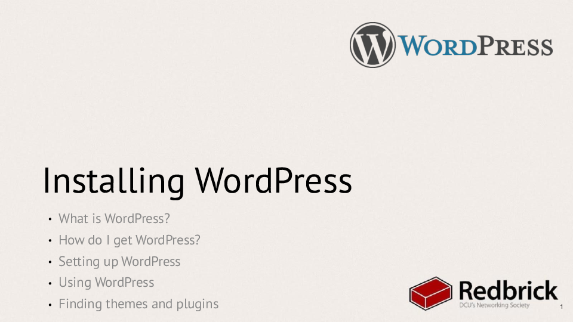](./wordpress-2015)
[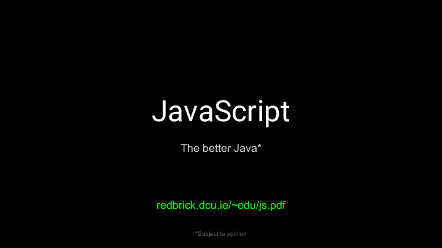](./js-2015)
[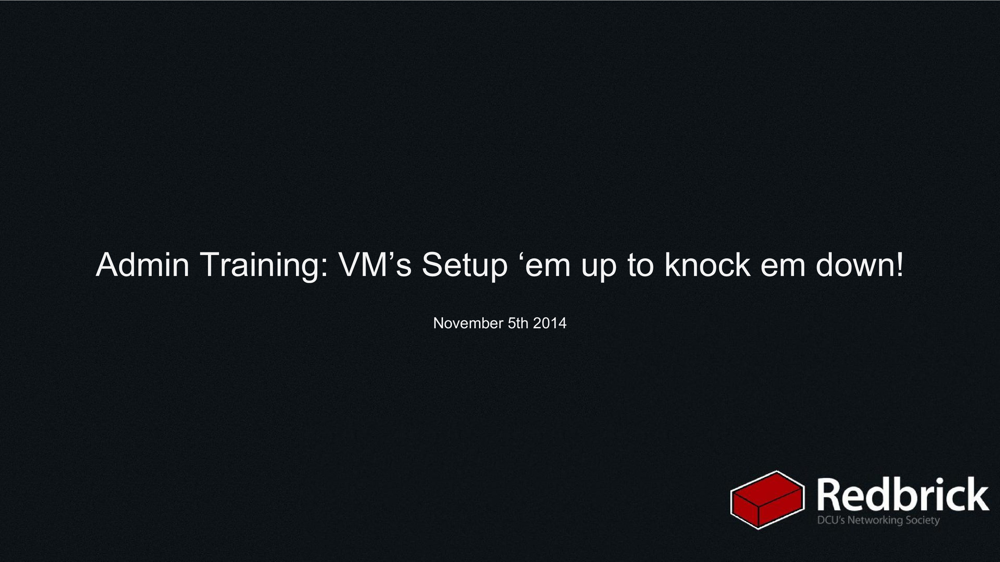](./vm)
[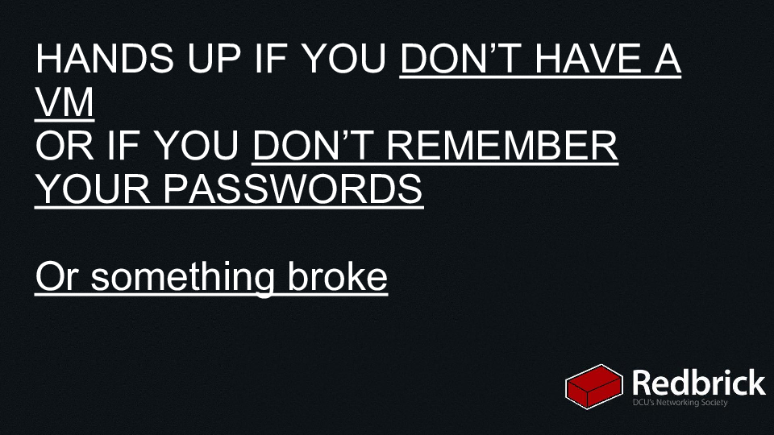](./securevm)
